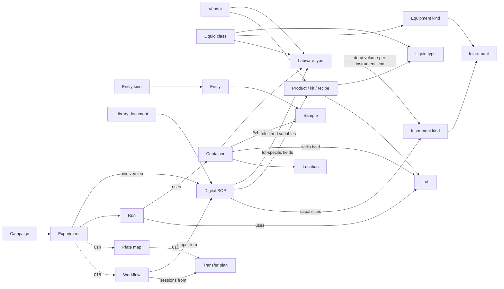

# Data model

Everything the lab knows is a **record**. Records share one envelope, one lifecycle, one history and one way of linking, so every registry and design document behaves the same for people and agents. Built: the record service ([core-records.md](../architecture/core-records.md)). Planned: every lab kind below.

## Kind, Instance, State

The backbone rule ([plan 000, 1.1](../plans/000-foundation-architecture.md)). A kind is a reusable definition, an instance is a real registered thing, and state is what changes about it over time.

| Registry | Kind | Instance | State |
| --- | --- | --- | --- |
| Labware (007, 010) | Labware type: Corning 3570, geometry, volumes | Container: barcoded plate `PLT-000345` | Well contents, volumes, location, sealed |
| Instruments (008) | Instrument kind (Hamilton STAR), equipment kind (Flex 1-channel pipette) | Registered instrument (serial, room) and its configuration; serial-bearing equipment items | Status, service dates, later live state from twins or the gateway |
| Reagents (009) | Product, kit or recipe; liquid type; liquid class | Lot (lot number, expiry, CoA values) | Containers holding the lot and their volumes (010) |
| Biology and chemistry (010) | Entity kind (plasmid, cell line, compound) and entity (`PLS-0012` with its sequence) | Sample (a miniprep, a cell bank) | Aliquots in containers |
| SOPs (011, 012) | Library document; digital SOP | Confirmed SOP version | Executions in runs |
| Experiments (013) | Campaign | Experiment (the design) | Runs (each execution) |

Configurable instruments (Opentrons Flex) and fixed ones (Hamilton STAR) use the same model: the kind declares which mounts and sites exist and who may change them; the instance records what is installed now, with history.

## The record envelope

| Field | Meaning |
| --- | --- |
| `id` | Internal ID: prefix plus ULID (`lwt_01J9Z3K8…`). Hidden from people by default |
| `kind` | What sort of record this is |
| `name` | Readable name: the kind's prefix plus a per-lab counter (`LWT-0001`). Unique in the lab, never reused, even after archive or delete |
| `label` | Free display name |
| `orgId`, `labId` | Tenancy. Records in another lab are "not found" |
| `status` | `draft`, `active` or `archived` |
| `version` | Goes up by one on every change |
| `attributes` | Kind-specific fields, validated against the kind's schema |
| `evidence` | Per attribute: where its value came from, who set it, when |
| `reviews` | Per section: who confirmed it, when, at which version, and the values they saw |
| `createdAt`, `createdBy`, `updatedAt`, `updatedBy` | Time (UTC) and actor |

## Rules the record service enforces

- **Lifecycle:** `draft → active → archived`. Archived records can't be edited, only unarchived. Only drafts with no inbound links can be deleted, and their history goes with them. Active records are archived, never deleted.
- **History:** every change stores the full record, actor, operation and reason in `record_versions`. Restore writes a new version; history is never rewritten.
- **Optimistic concurrency:** every change passes the version it last saw; a stale one is refused with `version_conflict`, so an agent and a person can't overwrite each other.
- **Links:** each kind declares how to read references out of its attributes, and the service keeps `record_links` in sync. New links must target an existing, non-archived record in the same lab. "Where is this used" is one query.
- **Errors** carry a `code` (`not_found`, `invalid_attributes`, `version_conflict`, `invalid_link`, `linked`, `not_ready`…) and a message written for a person or an agent to act on.

## Evidence sources

Every attribute's value has a source ([ADR 0021](../decisions/0021-draft-and-confirm.md)):

| Source | Meaning |
| --- | --- |
| `assumed` | An agent set it and named no source. Shown in agent ink until confirmed |
| `stated` | The person told the agent. Shown as "you told …"; still confirmed with its section. Only agents can name it |
| `person` | A person entered it. Nobody can claim it; it comes from who you are |
| `datasheet` | From a vendor datasheet |
| `imported` | From an import (Opentrons library, echo650-twin catalog, Venus export) |
| `measured` | Measured in the lab |
| `calculated` | Computed from other values, usually by a calculator operation (ADR 0024), which is named with its inputs |

Seed data uses its own marking per value: verified, estimated or unknown. Loaders map these onto evidence.

## IDs and readable names

Built kinds: `labware_type` and `vendor` (007a), plus the test `widget` (`WDG-0001`, registered when `AILAB_TEST_KINDS=1`). Everything else is planned; prefixes come from the plans and are unique across kinds (the kind registry refuses duplicates).

| Kind | ID prefix | Readable name | Plan |
| --- | --- | --- | --- |
| Vendor or manufacturer | `vnd_` | `VND-0001` | 007, built |
| Labware type | `lwt_` | `LWT-0001` | 007, built |
| Instrument kind | `ink_` | `INK-0001` | 008 |
| Equipment kind | `eqk_` | `EQK-0001` | 008 |
| Instrument | `ins_` | `INS-0001` (plus a short name like `FLX-01`) | 008 |
| Equipment item | `eqp_` | `EQP-0001` | 008 |
| Product, kit or recipe | `prd_` | `PRD-0001` | 009 |
| Liquid type | `lqt_` | `LQT-0001` | 009 |
| Liquid class | `lqc_` | `LQC-0001` | 009 |
| Lot | `lot_` | `LOT-0001` | 009 |
| Entity kind | `enk_` | `ENK-0001` | 010 |
| Entity | `ent_` | per kind: `PLS-0012`, `CMP-0003`, `CEL-0001` | 010 |
| Sample | `smp_` | `SMP-0001` | 010 |
| Container | `lw_` | per family: `PLT-`, `TUB-`, `FLK-`, `RES-`, `BOX-`; the name is the barcode | 010 |
| Location | `loc_` | `LOC-0001` | 010 |
| Library document | `doc_` | `DOC-0001` | 011 |
| File | `fil_` | `FIL-0001` | 011 |
| Digital SOP | `sop_` | `SOP-0001` | 012 |
| Campaign | `cam_` | `CAM-001` | 013 |
| Experiment | `exp_` | `EXP-0001` | 013 |
| Run | `run_` | `RUN-0001` | 013 |
| Set | `set_` | `SET-001` | 013 |
| Layout template | `lyt_` | `LYT-0001` | 014 |
| Plate map | `pmp_` | `PMP-0001` | 014 |

The seed's placeholder `DL` + 6 digit barcodes are replaced by container names (010-V5).

## Units

A `Quantity` is `{ "value": "12.5", "unit": "uL" }`: an exact decimal string and an ASCII unit code with a display symbol (µL). Conversion only happens within a family; mass to molar needs a molar mass from the record; temperatures convert but don't add.

Families today: volume, mass, amount, molar concentration, mass concentration (including ng/µL), molar mass, time, temperature, cells and cell density, optical density per wavelength (OD600), %v/v, %w/v, %w/w, enzyme activity (U, U/mL), CFU and CFU density, length (m to nm, for geometry and wavelengths), rotational speed (rpm) and relative centrifugal force (× g).

## Actors

Every change records who made it: a person (`user`), or an agent on behalf of a person (`agent`, with its name, the person and a session reference such as the conversation). Agent tokens act as a named agent. Roles and permissions come later; any person in the lab may confirm today.

## How the registries connect

## Handling rules and constraints

A typed vocabulary defined in 009 and shared with 010: storage temperature range, light sensitivity, freeze-thaw limit, stability after opening, reconstitution or thaw, equilibrate before use, mix-before-use window, max time out of storage, hygroscopic, time to read after a step, and live-cell rules from 010. Each rule carries its source (vendor with link, lab convention, lab memory) and whether the scheduler **enforces** it or it is **advice**.

Rules flow: entity kinds and products carry them, an entity can tighten its kind's, a container inherits the rules of everything in it with the strictest winning, digital SOP steps add timing windows, and the scheduler (019) prunes schedules that break them and shows the source ("30 min limit, from HEK293 cell line kind").

## Design documents

Designs are records too, with sections and readiness checks: labware types, instrument configurations and workcells, products and liquid classes, entity kinds and imports, digital SOPs, experiments, layout templates, plate maps, transfer plans, worklist formats, assay templates, workflows and workflow templates. Downstream work uses confirmed versions only. See [Agents, drafts and review](agents-and-review.md).
